# PITHQUEST: Virtual Food Laboratory Challenge
## Official Laboratory User Manual & Instructional Field Guide
### *Coconut Pith Crackers (Ubod ng Niyog) Processing & Manufacturing Simulation*

---

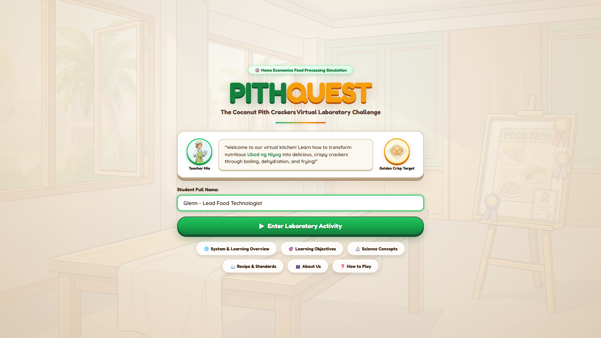

---

## 📖 Table of Contents

1. [Executive Overview & Pedagogical Mission](#1-executive-overview--pedagogical-mission)
2. [System Specifications & Environmental Setup](#2-system-specifications--environmental-setup)
3. [User Interface & Laboratory HUD Architecture](#3-user-interface--laboratory-hud-architecture)
   - [3.1 Top Navigation & Header HUD](#31-top-navigation--header-hud)
   - [3.2 Mentor Guide Sidebar: Teacher Mia](#32-mentor-guide-sidebar-teacher-mia)
   - [3.3 Central Workstation Canvas](#33-central-workstation-canvas)
   - [3.4 Right Equipment & Ingredient Inventory Rack](#34-right-equipment--ingredient-inventory-rack)
4. [Pre-Lab Reference Modals](#4-pre-lab-reference-modals)
   - [4.1 Learning Objectives & Competencies](#41-learning-objectives--competencies)
   - [4.2 Standard Recipe & Processing Science Standards](#42-standard-recipe--processing-science-standards)
   - [4.3 System Architecture & Learning Methodology](#43-system-architecture--learning-methodology)
5. [Pre-Test Diagnostic Assessment (Orientation Phase)](#5-pre-test-diagnostic-assessment-orientation-phase)
   - [5.1 Task 1: Personal Protective Equipment (PPE) Selection](#51-task-1-personal-protective-equipment-ppe-selection)
   - [5.2 Task 2: 7-Step Sanitary Handwashing Protocol](#52-task-2-7-step-sanitary-handwashing-protocol)
   - [5.3 Task 3: Food-Contact Tool Safety Inspection](#53-task-3-food-contact-tool-safety-inspection)
   - [5.4 Task 4: Raw Ingredient Quality Inspection](#54-task-4-raw-ingredient-quality-inspection)
6. [The 8 Hands-on Culinary Processing Stages](#6-the-8-hands-on-culinary-processing-stages)
   - [6.0 Teacher Mia's Stage Pre-Check Checkpoints](#60-teacher-mias-stage-pre-check-checkpoints)
   - [6.1 Stage 1: Washing & Hydrothermal Pre-Cooking (Boiling)](#61-stage-1-washing--hydrothermal-pre-cooking-boiling)
   - [6.2 Stage 2: High-Shear Mechanical Pureeing & Grinding](#62-stage-2-high-shear-mechanical-pureeing--grinding)
   - [6.3 Stage 3: Formulation & Starch Ratio Blending (1:1 Ratio)](#63-stage-3-formulation--starch-ratio-blending-11-ratio)
   - [6.4 Stage 4: Geometric Shaping & Precision Rectangular Molding](#64-stage-4-geometric-shaping--precision-rectangular-molding)
   - [6.5 Stage 5: Atmospheric Starch Steaming & Gelatinization](#65-stage-5-atmospheric-starch-steaming--gelatinization)
   - [6.6 Stage 6: Forced-Air Convection Cabinet Dehydration](#66-stage-6-forced-air-convection-cabinet-dehydration)
   - [6.7 Stage 7: Flash Deep Frying & Superheated Expansion](#67-stage-7-flash-deep-frying--superheated-expansion)
   - [6.8 Stage 8: Sanitary Hermetic Packaging & Nitrogen Shielding](#68-stage-8-sanitary-hermetic-packaging--nitrogen-shielding)
7. [Post-Test Assessment: Chronological Process Sequencing](#7-post-test-assessment-chronological-process-sequencing)
8. [Comprehensive Diagnostic Audit, Scoring & Certification](#8-comprehensive-diagnostic-audit-scoring--certification)
9. [Food Science Principles & HACCP Summary](#9-food-science-principles--haccp-summary)
10. [Pro Tips, Error Prevention & Troubleshooting](#10-pro-tips-error-prevention--troubleshooting)

---

## 1. Executive Overview & Pedagogical Mission

**PITHQUEST** is an interactive, browser-based gamified educational laboratory simulation engineered specifically for **Home Economics (HE)** and **Food Technology** students. 

The software models the full industrial valorization lifecycle of **Coconut Pith** (*Ubod ng Niyog* — the edible apical meristem of the coconut palm), transforming agricultural coproducts into shelf-stable, high-fiber, crispy culinary crackers (**Ubod CRUNCH** / *Kropek*).

```
   [ Raw Coconut Pith ] ➔ [ Washing & Boiling ] ➔ [ High-Shear Puree ]
                                                         │
   [ Rectangular Molding ] ◄── [ 1:1 Starch Blending ] ◄─┘
            │
            ▼
   [ 100°C Steam Gelatinization ] ➔ [ 90°C Cabinet Dehydration ]
                                                │
   [ 50g Hermetic Packaging ] ◄── [ high-temperature Flash Deep Frying ] ◄─┘
```

### Core Pedagogical Pillars
* **Cognitive Mastery:** Understand the biochemical role of amylose and amylopectin starches, hydrothermal cellulose softening, moisture sorption isotherms, and vapor pressure mechanics during frying.
* **Psychomotor Skill Acquisition:** Practice exact sequential food preparation unit operations, equipment calibration, and thermal management via direct manipulation.
* **Affective & Ethical Safety:** Internalize Personal Protective Equipment (PPE), WHO 7-step sanitary hand hygiene, cross-contamination barriers, and HACCP Critical Control Points (CCPs).

---

## 2. System Specifications & Environmental Setup

PithQuest is designed to run locally or over a campus network without requiring third-party plugins.

| Feature | Requirement / Recommendation |
| :--- | :--- |
| **Platform** | Modern Web Browser (Google Chrome, Microsoft Edge, Mozilla Firefox, Safari 16+) |
| **Minimum Display Width** | **768 pixels** (Dedicated desktop, laptop, or landscape tablet display required) |
| **Screen Restriction** | Mobile phones or screens under 768px trigger a responsive restriction overlay |
| **Audio Hardware** | Stereo speakers or headphones (Procedural Web Audio synthesizer enabled) |
| **Input Methods** | Mouse Pointer, Trackpad, or Capacitive Touchscreen (Full Touch Support) |
| **Runtime Port** | `http://localhost:5173/` (Vite Development Server) |

> [!NOTE]
> When launching the application, click **"Enter Laboratory Activity"** on the initial preloading screen. This user gesture initializes the browser's procedural Web Audio context for realistic kitchen acoustics (sizzling, boiling, and timer chimes).

---

## 3. User Interface & Laboratory HUD Architecture

The PithQuest laboratory interface is organized into a balanced, 3-zone panoramic layout designed to minimize visual clutter while maximizing tactile engagement.

```
┌────────────────────────────────────────────────────────────────────────────┐
│ [LOGO]  (PRE) [1] [2] [3] [4] [5] [6] [7] [8] (POST) (RESULTS)  [STAGE] [MENU]│
├──────────────┬──────────────────────────────────────────────┬──────────────┤
│ 👩‍🍳 MENTOR    │                                              │ 📋 INVENTORY │
│ Teacher Mia  │           CENTRAL WORKSTATION CANVAS         │ Storage Rack │
│ • Dialogue   │                                              │ • Raw Ubod   │
│ • Tabs       │         [ Interactive Culinary Appliance /   │ • Rice Flour │
│ • Notes      │           Workstation Action Area ]          │ • Utensils   │
│ • Hints      │                                              │ • Seasonings │
└──────────────┴──────────────────────────────────────────────┴──────────────┘
```

### 3.1 Top Navigation & Header HUD
1. **Stage Breadcrumb Track:** Displays your current location from **PRE-TEST**, through **Stages 1 to 8**, **POST-TEST**, and **RESULTS**. Completed stages turn green with checkmarks; active stages pulse with a golden border.
2. **Current Stage Badge:** Indicates the active workstation unit operation (e.g., `STAGE 5: Starch Steaming`).
3. **Slide-Out Utility Menu (`≡ Menu`):** 
   - **Sound Toggle (`🔊 / 🔇`):** Mutes or enables procedural audio effects.
   - **Zoom Controls (`🔍- / 100% / 🔍+`):** Scales the physical interface between 50% and 160% to accommodate varying monitor sizes.
   - **Reset Workstation (`🔄`):** Resets the current station's item placements if a mistake occurs.
   - **Return to Main Menu (`🏠`):** Returns safely to the title cover while preserving diagnostic data.

### 3.2 Mentor Guide Sidebar: Teacher Mia
Located on the left column, **Teacher Mia** provides continuous instruction throughout your laboratory session:
* **Pedagogical Tabs:** Switch between **Guide** (task instructions), **Science** (chemical & physical principles), **Tips** (efficiency tricks), **Safety** (hazard warnings), and **Recipe** (formula reference).
* **Typewriter Dialogue Bubble:** Audio-synchronized conversational guidance explaining the rationale of each step.
* **Standard Note Box:** Outlines standard culinary operating procedures (SOPs).
* **Laboratory Hint Box:** Provides contextual hints if you are unsure of the next item placement.
* **Collapse Button (`◀ / ▶`):** Folds the mentor column to give 100% focus to the center workstation.

### 3.3 Central Workstation Canvas
The main stage where culinary actions take place:
* **Interactive Containers:** Dynamic appliances (sinks, cutting boards, stockpots, food processors, steamers, dehydrators, deep fryers, and sealers).
* **Multi-State Target Dropzones:** Clearly labelled target zones with visual hover highlights.
* **Live Instrumentation:** Built-in digital thermometers, moisture gauges, cycle countdown timers, and flame indicators.
* **Dual-Input Mechanics:**
  - **Drag-and-Drop:** Click and drag an item from the right inventory rack onto the central target.
  - **Tap-to-Place:** Click/tap an item once on the right tray (it attaches to your cursor), then click the target workstation to place it effortlessly.

### 3.4 Right Equipment & Ingredient Inventory Rack
The vertical staging tray holding all required tools, ingredients, and packaging materials for the active stage. Items already processed become dimmed (`used`), preventing duplicate placements.

---

## 4. Pre-Lab Reference Modals

Before commencing laboratory operations, students can consult reference documentation from the Title Screen.

### 4.1 Learning Objectives & Competencies
Click **🎯 Learning Objectives** on the Title Screen to inspect the curricular targets established by the Department of Home Economics.

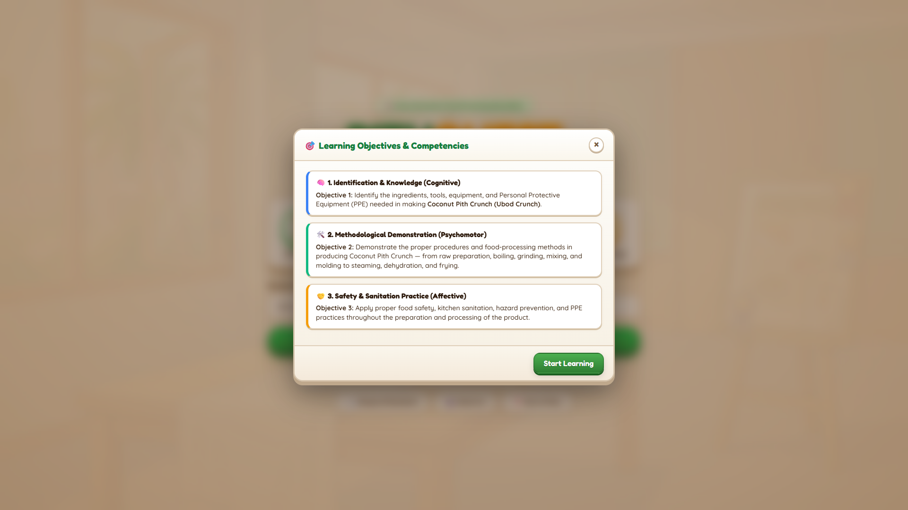

* **Cognitive Objective:** Identify ingredients, tools, and PPE needed for Ubod Crunch production.
* **Psychomotor Objective:** Demonstrate correct food-processing techniques across all 8 stages.
* **Affective Objective:** Practice strict kitchen sanitation, hazard prevention, and food safety standards.

---

### 4.2 Standard Recipe & Processing Science Standards
Click **📖 Recipe & Standards** to view the standardized formula and critical physical parameters.

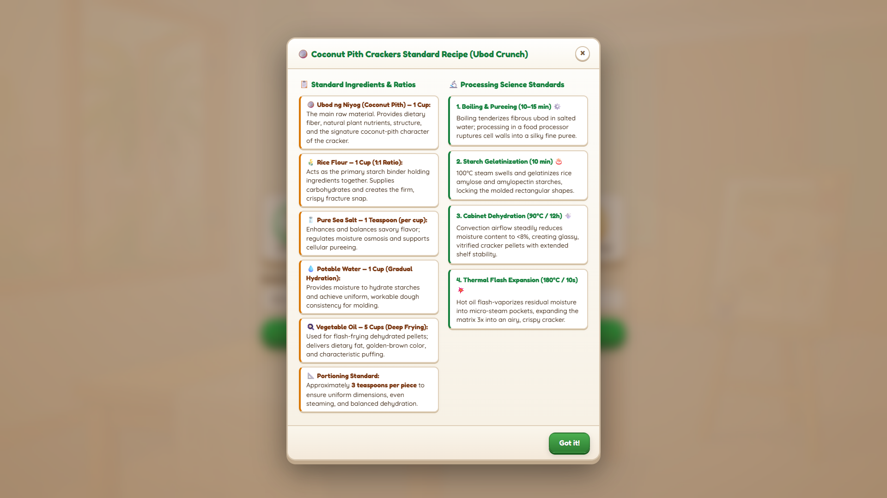

#### Standard Ingredient Ratios
* **🥥 Coconut Pith (Ubod ng Niyog) — 1 Cup:** Provides dietary fiber, organic minerals, and unique coconut-pith body.
* **🌾 Rice Flour — 1 Cup (1:1 Ratio):** Primary starch binder supplying amylose polymers for crisp fracture snap.
* **🧂 Pure Sea Salt — 1 Teaspoon:** Flavor enhancer and osmotic cell-softening agent.
* **💧 Potable Water — 1 Cup:** Hydrates dry starches into cohesive, pliable dough.
* **🍳 Vegetable Cooking Oil — 5 Cups:** High-smoke-point frying medium for high-temperature rapid expansion.
* **📐 Portioning Specification:** Uniform **50mm × 25mm × 2mm** rectangular wafers (~3 teaspoons per portion).

---

### 4.3 System Architecture & Learning Methodology
Click **🌐 System & Learning Overview** to inspect the learning system workflow and diagnostic tracking mechanisms.


---

## 5. Pre-Test Diagnostic Assessment (Orientation Phase)

Upon entering the laboratory, all students complete a 4-part Pre-Test diagnostic assessment to establish their baseline knowledge of hygiene, tool safety, and ingredient quality.

### 5.1 Task 1: Personal Protective Equipment (PPE) Selection


#### Instructions:
1. Examine the 8 attire cards presented on the workstation.
2. Click to select all **approved food-grade protective items**:
   - ✅ **Sanitary Hairnet:** Prevents hair follicles from entering food contact surfaces.
   - ✅ **Clean Lab Gown / Apron:** Shields sanitized prep areas from outdoor clothing dust.
   - ✅ **Clear Spit Guard / Mask:** Eliminates oral aerosol droplet dispersion.
   - ✅ **Food-Grade Vinyl Gloves:** Maintains aseptic touch barriers.
   - ✅ **Thermal Heat Mitts:** Certified thermal protection for handling hot steamers.
   - ✅ **Non-Slip Safety Shoes:** Prevents kitchen falls and shields against hot oil spills.
3. ⚠️ **Avoid Distractor / Hazardous Items:**
   - ❌ *Knitted Wool Scarf:* Sheds fibers into food and presents a severe fire hazard near burners.
   - ❌ *Heavy Chemical Goggles:* Fogs up in food kitchens and obstructs culinary visibility.
4. Click **"Confirm PPE Selection"** to lock your answers into the audit database.

---

### 5.2 Task 2: 7-Step Sanitary Handwashing Protocol

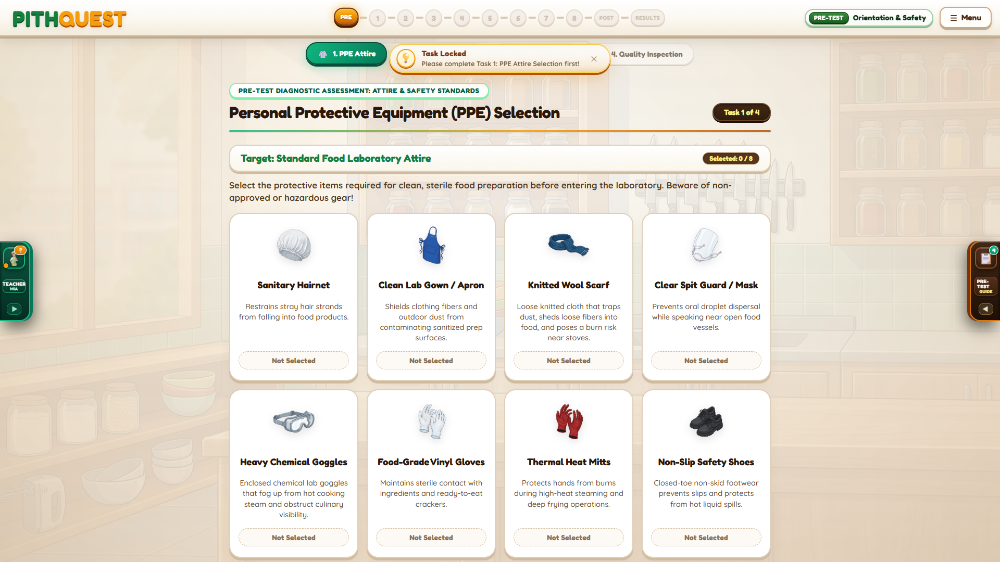

#### Instructions:
1. Arrange the 7 World Health Organization (WHO) sanitary handwashing steps into strict chronological order from Step 1 to Step 7.
2. Drag cards or click cards to swap positions:
   - **Step 1:** Wet hands thoroughly under clean, warm running water.
   - **Step 2:** Apply antibacterial liquid soap generously to palm surfaces.
   - **Step 3:** Rub hands palm to palm to produce a rich cleansing lather.
   - **Step 4:** Interlace fingers and scrub the backs of both hands and digits.
   - **Step 5:** Clean thumbs, palms, and fingernails with friction for at least 20 seconds.
   - **Step 6:** Rinse thoroughly under running potable water until soap residue is gone.
   - **Step 7:** Dry hands completely using clean, disposable single-use paper towels.
3. ⚠️ **Beware of Contamination Distractors:** Do not use dirty cloth towels or touch dirty faucets with bare cleaned hands.
4. Click **"Confirm Handwashing Sequence"** to proceed.

---

### 5.3 Task 3: Food-Contact Tool Safety Inspection

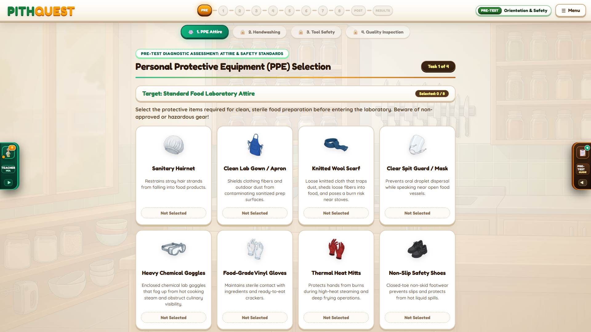

#### Instructions:
1. Conduct a quality audit on the culinary equipment cards:
   - **Chef's Knife:** Verify sharp, rust-free stainless steel blade vs. dull or chipped metal.
   - **Cutting Board:** Verify non-porous food-grade plastic vs. deeply gouged wooden boards harboring bacteria.
   - **Electric Food Processor:** Verify intact grounded electrical cord and secure interlocking safety lid.
   - **Steamer Pot:** Inspect clean vents and non-dented lid seal.
   - **Dehydrator Trays:** Verify sanitary stainless mesh trays without chemical corrosion.
2. Identify safe vs. defective equipment to prevent physical contamination and equipment hazards.
3. Click **"Confirm Tool Inspection"**.

---

### 5.4 Task 4: Raw Ingredient Quality Inspection

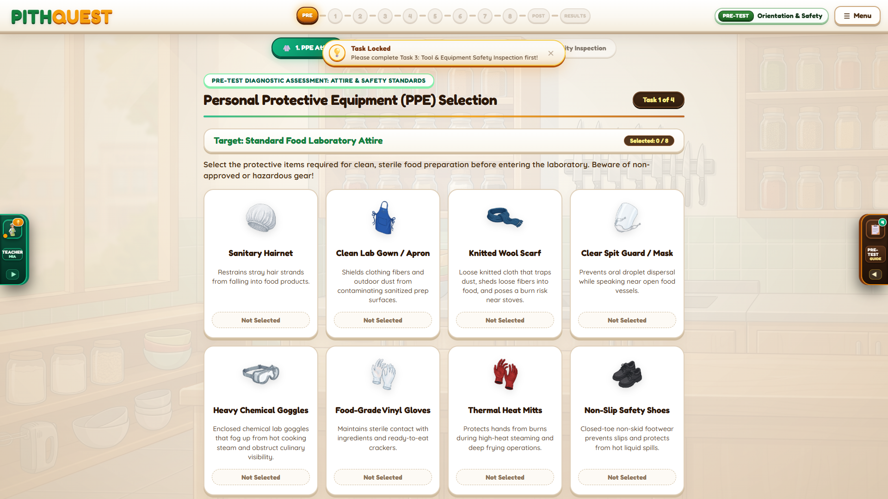

#### Instructions:
1. Inspect the incoming raw materials for the batch:
   - **Coconut Pith (Ubod):** Must be crisp, creamy white, with fresh vegetative aroma. Reject brown, oxidized, or sour-smelling pith.
   - **Rice Flour:** Must be powdery, dry, and free of weevils or moisture clumping.
   - **Potable Water:** Clean, transparent, odor-free drinking water.
   - **Vegetable Oil:** Clear, golden, low-viscosity liquid with high smoke point (reject dark or rancid oil).
2. Click **"Confirm Ingredient Inspection & Enter Laboratory"** to begin Stage 1.

---

## 6. The 8 Hands-on Culinary Processing Stages

### 6.0 Teacher Mia's Stage Pre-Check Checkpoints
At the beginning of each stage, Teacher Mia presents a conceptual **Food Science Checkpoint Question**.

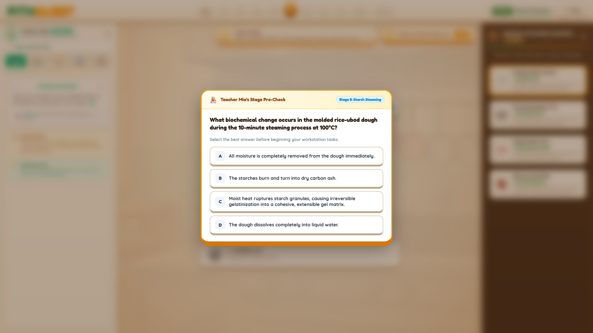

Students evaluate the underlying chemical and physical principles behind the upcoming stage (such as starch gelatinization kinetics, hydrothermal softening, or vapor pressure dynamics). Select your answer neutrally and click **"Proceed to Workstation"** to unlock the interactive station.

---

### 6.1 Stage 1: Washing & Hydrothermal Pre-Cooking (Boiling)

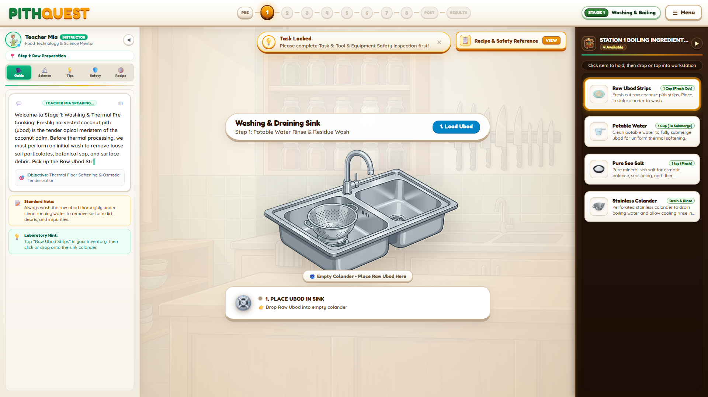

#### Objective:
Clean fresh ubod to eliminate dirt/sap and boil in salted water to tenderize tough cellulosic plant fibers.

#### Step-by-Step Procedure:
1. **Load Ubod into Sink Colander:** Select **Raw Ubod Strips** from your inventory and place into the stainless steel sink colander.
2. **Rinse with Potable Water:** Select **Potable Water** to wash away plant sap and debris.
3. **Transfer to Stockpot:** Move the washed ubod into the stockpot sitting on the induction burner.
4. **Season with Sea Salt:** Add **1 Teaspoon Pure Sea Salt** to regulate osmotic tenderization.
5. **Ignite Burner:** Click the stove dial to ignite the burner and simmer for **10–15 minutes** until the ubod reaches a soft, fork-tender texture.
6. **Drain:** Pour contents through the colander to separate hot water from tenderized ubod.

> **🔬 Food Science Rationale:** Hydrothermal boiling breaks down hemicellulose and pectin within the plant cell walls, rendering the tough apical fibers soft enough for microscopic pureeing. The heat also denatures polyphenol oxidase enzymes, preventing unappealing enzymatic browning.

---

### 6.2 Stage 2: High-Shear Mechanical Pureeing & Grinding

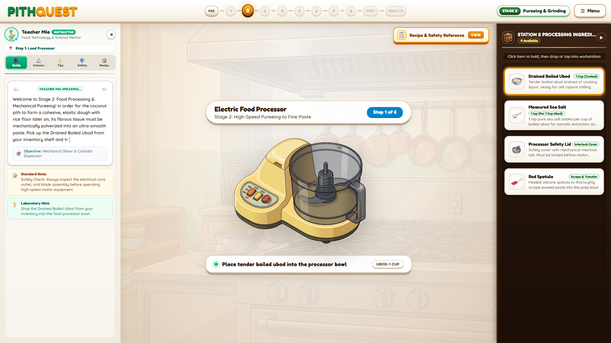

#### Objective:
Homogenize boiled ubod fibers into an ultra-smooth, silky puree to eliminate grittiness.

#### Step-by-Step Procedure:
1. **Open Processor Lid:** Click the processor lid to access the stainless steel blade chamber.
2. **Load Tender Ubod:** Transfer the drained, boiled ubod from your tray into the food processor bowl.
3. **Add Water Lubricant:** Pour **1/4 Cup Warm Potable Water** to facilitate high-speed shear vortexing.
4. **Secure Safety Lid:** Place the locking lid onto the processor until the safety latch clicks.
5. **Engage High-Speed Pulse:** Press the pulse button for **45 seconds** until a completely homogeneous puree forms.

> **🔬 Food Science Rationale:** High-shear mechanical blades rupture vegetable fiber bundles into micro-particles. This uniform slurry ensures that starch granules can disperse intimately during dough kneading, creating a continuous, rupture-free matrix.

---

### 6.3 Stage 3: Formulation & Starch Ratio Blending (1:1 Ratio)

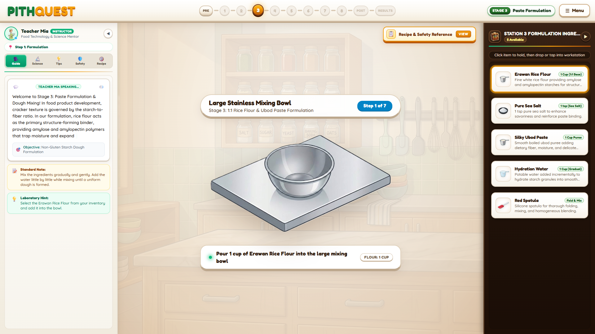

#### Objective:
Formulate the dough using an exact **1:1 stoichiometric ratio** of pureed ubod to rice flour.

#### Step-by-Step Procedure:
1. **Tare Mixing Bowl:** Place the large mixing bowl on the center counter.
2. **Dispense Ubod Puree:** Add **1 Cup Ubod Puree** to the bowl.
3. **Add Rice Flour:** Add **1 Cup Fine Rice Flour** (1:1 volumetric ratio).
4. **Add Pure Sea Salt:** Sprinkle **1 Teaspoon Pure Sea Salt** for balanced flavor.
5. **Knead Dough:** Use the silicone spatula to fold and knead the mixture until a smooth, pliable, non-sticky dough forms.

> **🔬 Food Science Rationale:** Rice flour is composed of amylose (linear starch) and amylopectin (branched starch). Blending at an exact 1:1 ratio provides the ideal balance: amylose gives structural firmness and fracture crunch, while ubod fiber prevents excessive starch retrogradation.

---

### 6.4 Stage 4: Geometric Shaping & Precision Rectangular Molding

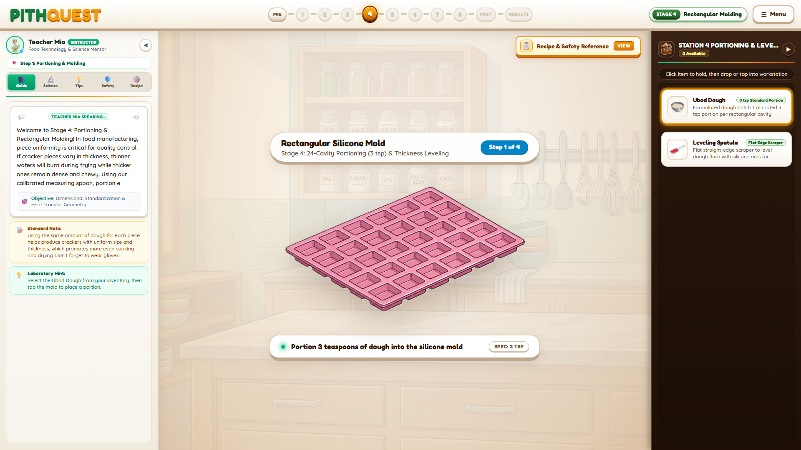

#### Objective:
Form the dough into uniform rectangular wafers (**50mm × 25mm × 2mm**) to guarantee even heat penetration.

#### Step-by-Step Procedure:
1. **Sanitize Multi-Cavity Mold:** Position the food-grade silicone rectangular mold on the prep bench.
2. **Portion Dough:** Deposit **3 Teaspoons of Dough** into each mold cavity.
3. **Level Surface:** Draw the stainless steel bench scraper across the mold surface to shear off excess dough and create flat, uniform 2mm thickness.
4. **Verify Cavities:** Ensure all 24 cavities are completely filled without trapped air pockets.

> **🔬 Food Science Rationale:** Non-uniform thickness leads to catastrophic drying defects: thin edges dry too fast and burn during frying, while thick cores retain moisture and become gummy. Strict dimensional uniformity ensures uniform thermal conductivity.

---

### 6.5 Stage 5: Atmospheric Starch Steaming & Gelatinization

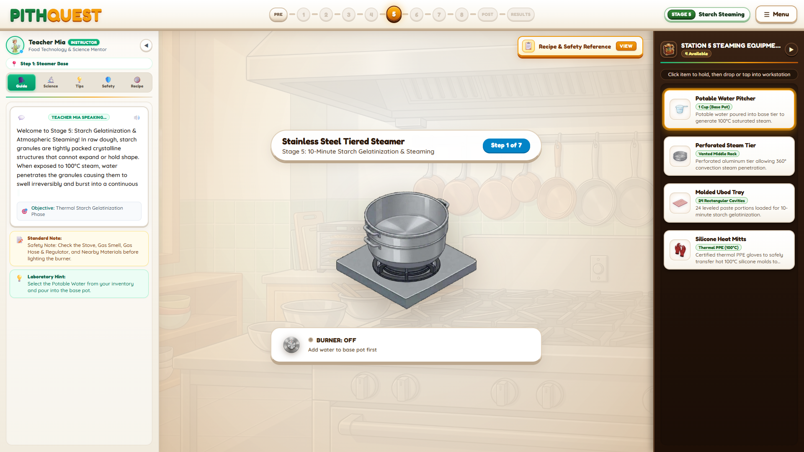

#### Objective:
Subject raw molded wafers to 100°C moist steam to trigger irreversible starch gelatinization.

#### Step-by-Step Procedure:
1. **Charge Base Pot with Water:** Pour **1 Cup Potable Water** into the lower tier of the aluminum steamer.
2. **Mount Perforated Tier:** Place the vented middle rack onto the base pot.
3. **Load Molded Tray:** Transfer the filled rectangular silicone mold onto the steaming rack.
4. **Cover with Domed Lid:** Seal the steamer with the domed lid to trap saturated steam.
5. **Ignite Stove & Steam (10 Minutes):** Turn on the gas burner. Watch the digital temperature gauge rise to **100°C** and maintain rolling steam for **10 minutes**.
6. **Don Silicone Heat Mitts:** Equip thermal gloves before lifting the hot lid.
7. **Transfer to Cooling Rack:** Move the steamed mold to the wire cooling rack to set the gel matrix.

> **🔬 Food Science Rationale:** At 65°C–85°C in the presence of excess moisture, rice starch granules absorb water, swell irreversibly, and rupture. The amylose molecules leach out to form a continuous viscoelastic gel network. This cooked matrix is what traps expanding steam bubbles during frying.

---

### 6.6 Stage 6: Forced-Air Convection Cabinet Dehydration

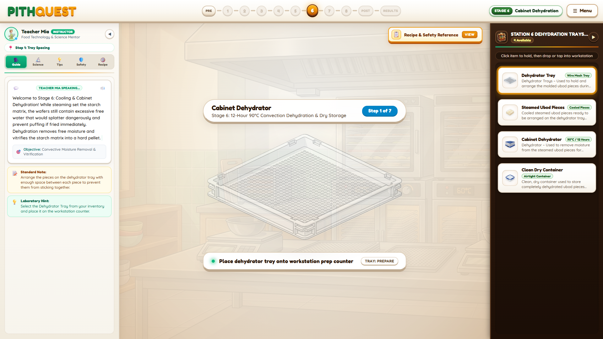

#### Objective:
Remove free water from gelatinized wafers, lowering moisture content from **75% down to <8%**.

#### Step-by-Step Procedure:
1. **Unmold Gelatinized Wafers:** Carefully pop the translucent, rubbery wafers out of the silicone mold.
2. **Arrange on Mesh Trays:** Place wafers onto perforated stainless steel dehydrator trays with 10mm spacing to allow air circulation.
3. **Slide Trays into Cabinet:** Insert trays into the forced-convection cabinet dehydrator.
4. **Configure Thermal Parameters:** Set temperature to **90°C** and run for the designated drying cycle.
5. **Monitor Digital Moisture Sensor:** Observe moisture drop steadily until the display signals **<8% Moisture Content (Glassy Vitrified State)**.

> **🔬 Food Science Rationale:** Dehydration transforms the gelatinized starch matrix into an amorphous "glassy" state. If moisture exceeds 12%, the pellets rot or fail to puff; if dried below 5%, the lack of internal water prevents steam generation during frying. An 8% moisture level is the thermodynamic sweet spot.

---

### 6.7 Stage 7: Flash Deep Frying & Superheated Expansion

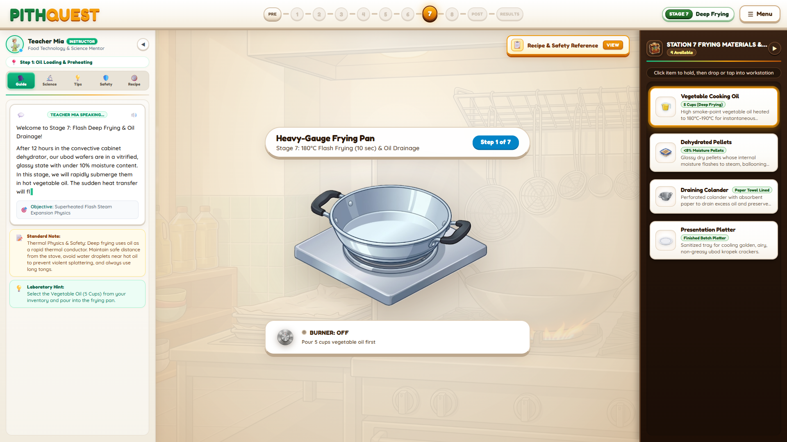

#### Objective:
Submerge glassy dried pellets into high-temperature oil, flash-vaporizing internal water to expand crackers **3× in size**.

#### Step-by-Step Procedure:
1. **Charge Frying Vessel:** Pour **5 Cups Vegetable Cooking Oil** into the heavy-gauge frying pan.
2. **Pre-heat Oil to high-temperature:** Turn on the burner and monitor the dial until the temperature indicator enters the **Green Optimal Zone (high-temperature range)**.
3. **Drop Dried Pellets:** Gently slide dehydrated pellets into the hot oil.
4. **Observe Flash Expansion:** Within **8–10 seconds**, the pellets puff dramatically to 300% of original volume.
5. **Retrieve with Wire Spider Skimmer:** Immediately scoop the floating, golden puffed crackers before over-browning occurs.
6. **Drain Oil:** Transfer onto a paper-towel-lined stainless colander to drain surface oil.

> **🔬 Food Science Rationale:** When glassy pellets hit high-temperature oil, the heat instantly superheats residual water trapped in the gelatinized starch into high-pressure steam. The expanding steam inflates millions of micro-alveoli within the starch matrix before escaping, leaving a porous, crispy, brittle fracture structure.

---

### 6.8 Stage 8: Sanitary Hermetic Packaging & Nitrogen Shielding

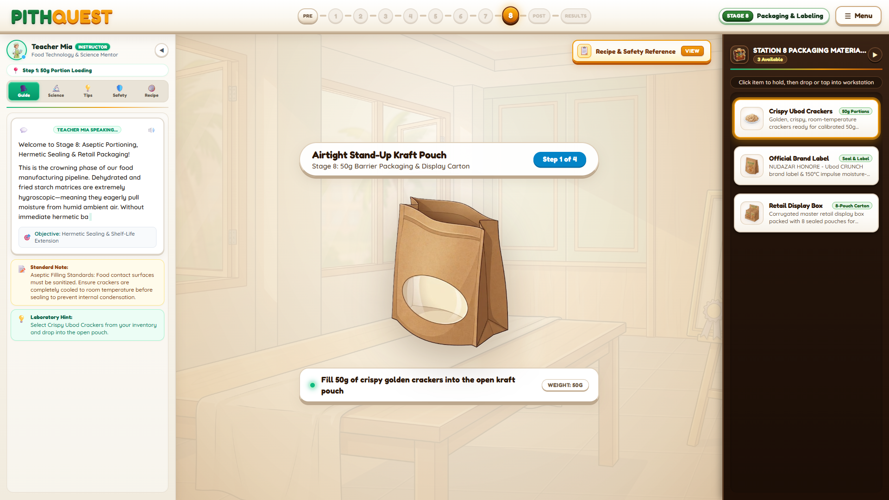

#### Objective:
Package finished crackers into barrier pouches with food-grade desiccants and hermetic heat seals.

#### Step-by-Step Procedure:
1. **Inspect Cooled Crackers:** Ensure crackers have cooled to ambient temperature (30°C) to prevent internal pouch sweating.
2. **Weigh Standard Serving:** Place **50 Grams of Crackers** into the pouch.
3. **Insert Silica Gel Desiccant:** Add one food-safe **Silica Gel Packet** to scavenge residual headspace moisture.
4. **Hermetic Heat Seal:** Align pouch top in the thermal bar sealer and press for 2 seconds to fuse the plastic barrier.
5. **Apply Quality & Nutrition Label:** Affix the official product label displaying ingredients, net weight (50g), allergen advisory, and expiration date.
6. **Pack into Master Retail Box:** Pack 8 sealed pouches into the retail presentation carton.

> **🔬 Food Science Rationale:** Starch crackers are highly hygroscopic; exposure to atmospheric moisture causes rapid water sorption, leading to starch retrogradation, loss of crispness (staleness), and microbial spoilage. Aluminum/kraft foil barriers and silica desiccants guarantee a **6-month commercial shelf life**.

---

## 7. Post-Test Assessment: Chronological Process Sequencing

After finishing all practical laboratory stages, students must demonstrate systemic mastery of the manufacturing pipeline by completing the **Post-Test Process Sequencing Challenge**.

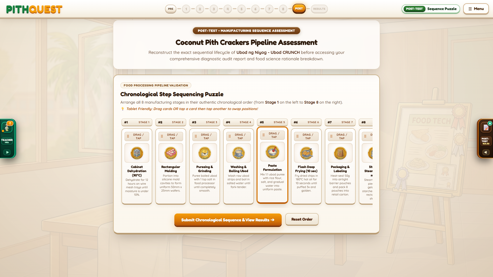

### Assessment Rules:
1. Reconstruct the authentic industrial manufacturing lifecycle by arranging all 8 stage cards in strict chronological sequence:
   - **Slot 1:** Stage 1 — Washing & Hydrothermal Pre-Cooking (Boiling)
   - **Slot 2:** Stage 2 — High-Shear Pureeing & Grinding
   - **Slot 3:** Stage 3 — Paste Formulation (1:1 Starch Ratio)
   - **Slot 4:** Stage 4 — Precision Rectangular Molding
   - **Slot 5:** Stage 5 — Starch Steaming & Gelatinization
   - **Slot 6:** Stage 6 — Cabinet Dehydration (<8% Moisture)
   - **Slot 7:** Stage 7 — Flash Deep Frying (high-temperature, 3× Expansion)
   - **Slot 8:** Stage 8 — Hermetic Packaging & Labeling
2. Click **"Submit Chronological Sequence & View Results"** to generate your official diagnostic audit report.

---

## 8. Comprehensive Diagnostic Audit, Scoring & Certification

The **Results Scene** synthesizes data from every phase of your laboratory experience into a diagnostic performance audit.


### What the Audit Evaluates:
1. **Candidate Profile & Verification:** Candidate name, completion timestamp, and assigned competency rank:
   - 🎖️ *Master Food Technologist (Advanced Competency)*
   - 🥈 *Proficient Food Technologist (Meets Laboratory Standards)*
   - 🥉 *Apprentice Technologist (Requires Supervised Review)*
2. **Pre-Test Attire & Hygiene Matrix:** Itemized count of correct PPE barriers selected, distractors flagged, and handwashing sequencing accuracy.
3. **Tool & Material Quality Audits:** Evaluation of safe equipment identification and fresh ingredient verification.
4. **Stage Pre-Check Mastery:** Performance across the 8 conceptual food science checkpoint questions.
5. **Manufacturing Lifecycle Fidelity:** Post-test ordering score with detailed food science rationale for every step.


### Official Laboratory Certificate of Completion
Students who meet laboratory competency standards unlock the official **Department of Home Economics Laboratory Certificate of Completion**.

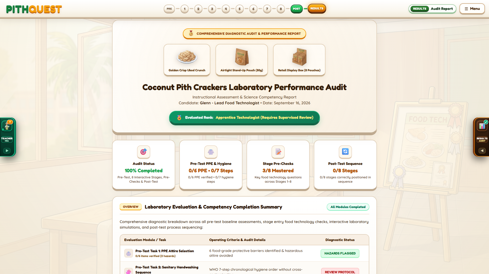

* **Print / Export PDF:** Click **"Print / Save Comprehensive Audit Report (PDF)"** to generate a permanent digital record or printed document for course grading and portfolio submission.

---

## 9. Food Science Principles & HACCP Summary

| Stage | Industrial Unit Operation | Critical Parameters | Key Biochemical / Physical Mechanism |
| :--- | :--- | :--- | :--- |
| **Stage 1** | Hydrothermal Pre-Boiling | 100°C / 10–15 min / Salted water | Breaks down hemicellulose & cell wall pectins; denatures polyphenol oxidases to stop browning. |
| **Stage 2** | Mechanical Micro-Pureeing | High-speed shear blades / 45 sec | Disintegrates fibrous strands into homogeneous micro-particles for seamless starch blending. |
| **Stage 3** | Stoichiometric Formulation | 1:1 Ubod-to-Rice Flour ratio | Establishes balanced amylose-amylopectin polymer ratios necessary for cohesive viscoelastic dough. |
| **Stage 4** | Dimensional Standardization | 50mm × 25mm × 2mm mold | Ensures uniform thermal diffusivity and moisture evaporation rates across all batches. |
| **Stage 5** | Atmospheric Steam Gelatinization | 100°C saturated steam / 10 min | Hydrates and ruptures starch granules; locks dough into an extensible, elastic gel matrix. |
| **Stage 6** | Convective Cabinet Dehydration | 90°C forced airflow / to <8% moisture | Evaporates free unbound water into an amorphous "glassy" state ready for vapor expansion. |
| **Stage 7** | Superheated Flash Frying | high-temperature range vegetable oil / 10 sec | Trapped water flashes to superheated steam, inflating starch alveoli 3× before hardening crisp. |
| **Stage 8** | Barrier Hermetic Packaging | Foil stand-up pouch + silica desiccant | Protects against water vapor transmission (prevents starch staling) and oil oxidation. |

---

## 10. Pro Tips, Error Prevention & Troubleshooting

### 💡 Pro Tips for Perfect Scores
* **Don't Rush the Pre-Test:** Read each PPE card carefully. Knit scarves and tinted goggles are intentional distractors that penalize safety scores.
* **Handwashing Friction:** In real laboratories as in the simulation, mechanical friction for at least 20 seconds is mandatory to dislodge transient pathogens.
* **Watch the Oil Thermometer:** Frying below 170°C results in oil-logged, soggy crackers that fail to puff. Frying above 200°C burns the surface before the core can expand. Always fry in the **Green Zone (high-temperature)**.
* **Cool Before Packaging:** Placing hot crackers directly into sealed plastic bags traps steam, creating condensation droplets that turn the crackers soggy within hours. Always cool crackers on wire racks first.

### 🛠️ Troubleshooting & FAQ

#### Q: The game says "Wide Screen Display Required" and blocks my screen.
* **Cause:** Your browser window width is under 768px, or you are holding a mobile phone in portrait orientation.
* **Fix:** Maximize your browser window, or rotate your tablet to **landscape mode**. The interactive multi-column lab layout requires at least 768 horizontal pixels.

#### Q: How do I zoom in or out if items look too large or small on my laptop?
* **Fix:** Click **≡ Menu** in the top-right corner of the HUD, then click the **🔍+ (Zoom In)** or **🔍- (Zoom Out)** buttons. Click **100%** to reset to default physical scale.

#### Q: An item is stuck to my cursor. How do I drop it?
* **Fix:** Right-click anywhere, press the `Escape` key, or tap the item again on the right rack to release it from your cursor.

#### Q: Can I reset a stage if I placed items in the wrong order?
* **Fix:** Yes! Open **≡ Menu** and click **🔄 Reset Workstation**. Your current stage workstation will reset cleanly without erasing your overall progress or Pre-Test scores.

#### Q: I don't hear any kitchen sounds or background audio.
* **Fix:** Browsers require a user click before allowing audio playback. Click anywhere on the screen, or open **≡ Menu** and toggle the **Sound Icon** to ensure audio is unmuted.

---

*PITHQUEST: Coconut Pith Crackers Virtual Laboratory Challenge — Developed for Home Economics & Food Technology Education.*
