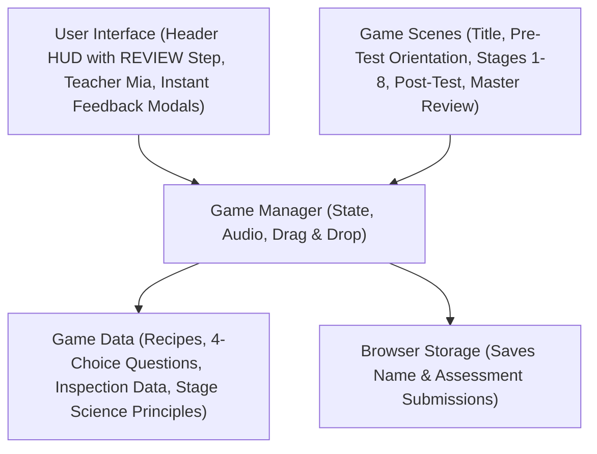
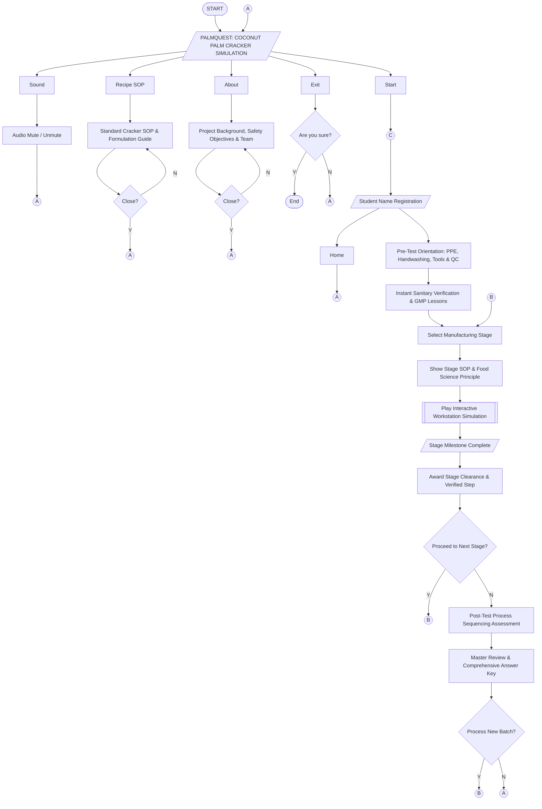
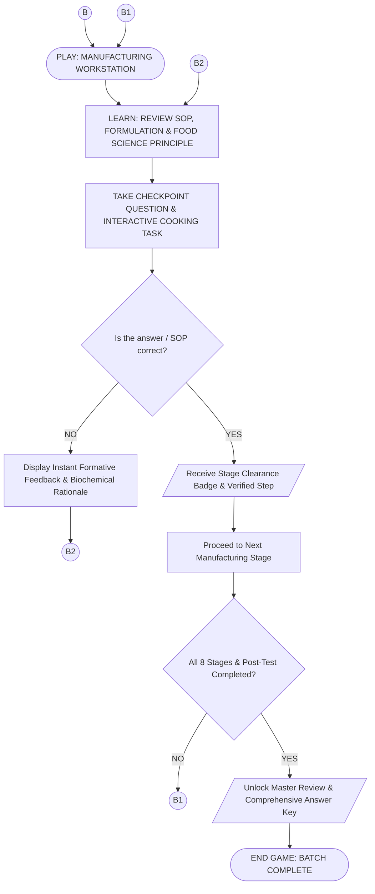

# PALMQUEST: System Architecture, UML Maps & Flowcharts
## Academic Manuscript & Documentation Reference (Updated Flow & Instructional Model)

---

## 1. UML Map 1: System Component Architecture

### Description
This diagram illustrates the revised component architecture of the PalmQuest web application, emphasizing its role as an active instructional material. The presentation layer comprises the primary user interface elements, including the top Header HUD (featuring the **`REVIEW`** final stage step), Teacher Mia's interactive pedagogical dialogues, recipe reference modals, and instant formative feedback checkpoint modals. These UI elements connect directly to the central Game Manager (`GameContext`), which governs application state, procedural Web Audio effects (`soundManager`), and interactive drag-and-drop mechanics.

The Game Manager coordinates scene routing across the five major architectural phases: the Title Screen, Pre-Test Orientation, eight interactive Manufacturing Workstations, the Post-Test Process Sequencing assessment, and the comprehensive **Master Review & Complete Answer Key**. The system persists student credentials and assessment choices to browser storage (`localStorage`) while drawing upon structured static data stores containing standardized recipe formulations, 4-choice checkpoint questions with distractors, equipment inspection criteria, and food science biochemical principles.

---

## 2. UML Map 2: Game State Navigation

```mermaid
stateDiagram-v2
    [*] --> TitleScreen: Open Application
    TitleScreen --> PreTest: Enter Name & Begin
    
    state PreTest {
        [*] --> PPE_Selection: Don Sanitary Barriers
        PPE_Selection --> PPE_Feedback: Instant Barrier Verification
        PPE_Feedback --> Handwashing: Proceed to Hygiene
        Handwashing --> Handwash_Feedback: Instant Slot-by-Slot Validation
        Handwash_Feedback --> Tool_Inspection: Proceed to Equipment QC
        Tool_Inspection --> Tool_Feedback: 1-Click Safe/Hazard Reveal
        Tool_Feedback --> Ingredient_QC: Inspect Raw Materials
        Ingredient_QC --> Ingredient_Feedback: 1-Click Freshness Reveal
        Ingredient_Feedback --> [*]: Pre-Test Verified
    }
    
    PreTest --> Stage1_to_8: Unlock Manufacturing Workstations
    
    state Stage1_to_8 {
        [*] --> PreCheckQuestion: Open Stage
        PreCheckQuestion --> InstantScienceReveal: 1-Click Right/Wrong & Principle
        InstantScienceReveal --> InteractiveWorkstation: Proceed to Hands-On Cooking
        InteractiveWorkstation --> StageComplete: Finish SOP Steps
        StageComplete --> [*]: Advance to Next Stage (1 to 8)
    }
    
    Stage1_to_8 --> PostTest: Complete Packaging (Stage 8)
    
    state PostTest {
        [*] --> ArrangeTimeline: Reconstruct 8-Stage Flow
        ArrangeTimeline --> VerifySequence: Submit Sequence
        VerifySequence --> InstantSequenceFeedback: Real-Time Slot Validation & Unit Ops Lesson
        InstantSequenceFeedback --> [*]: Sequence Debriefed
    }
    
    PostTest --> MasterReview: Proceed to Master Review
    
    state MasterReview {
        [*] --> QuickJumpNavigation: 6-Part Directory
        QuickJumpNavigation --> StudyMasterAnswerKey: 4-Choice Review & Science Principles
        StudyMasterAnswerKey --> PrintStudyGuide: Print / Save PDF
        StudyMasterAnswerKey --> RestartBatch: Process New Batch
    }
    
    MasterReview --> TitleScreen: Restart Batch
```

### Description
This state diagram illustrates the operational state transitions of PalmQuest under its formative instructional model. Rather than withholding feedback until the end of the session, the application provides **immediate right/wrong verification at every milestone**:
1. **Pre-Test State**: Divided into four sequential safety activities (PPE attire selection, WHO 7-step handwashing, tool safety inspection, and raw ingredient quality control). Each activity provides instant visual confirmation (highlighting compliant items in green, hazards in red, and missed standards in amber) alongside teacher audio feedback and food hygiene principle callouts before unlocking the next task.
2. **Manufacturing Stages State (Stages 1–8)**: Each stage begins with an instructional Checkpoint Question Modal employing a **1-click instant reveal (Option B)**. Selecting any option immediately illuminates whether it was correct or incorrect, indicates the recommended standard procedure, plays auditory feedback, displays the underlying biochemical rationale, and unlocks the interactive cooking simulation.
3. **Post-Test Sequencing State**: The student arranges the eight production stages chronologically. Submitting the timeline executes real-time slot verification with target position indicators and presents the unit operations progression lesson.
4. **Master Review State**: Replaces traditional scorecards and certificates with a pressure-free **Instructional Debrief & Complete Master Answer Key**, featuring a 6-part navigation directory, full 4-choice question breakdowns, and an option to print a comprehensive study guide PDF or restart a new laboratory batch.

---

## 3. System Flowchart

### Figure 46. System Flowchart

The flowchart shows the User Interface and operational architecture of the PalmQuest educational web application, where the system initiates once the web application is loaded in a modern web browser. Upon launching the application, an asset initialization and viewport verification check occurs (ensuring a tablet or desktop display width of at least 768px), after which the title screen is displayed, serving as the main menu hub.

The main menu features five primary interaction pathways: **Start**, **Sound**, **Recipe SOP**, **About**, and **Exit**:
- Pressing the **Start** button directs the student to user identification (entering their student name) and initiates the learning sequence via Connector `(C)`, leading into the Pre-Test Orientation module.
- The **Sound** button allows users to toggle procedural sound synthesis and instructional audio on or off to accommodate classroom or self-paced environments, returning directly to the main menu hub via Connector `(A)`.
- The **Recipe SOP** button opens a reference modal detailing standard operating procedures, raw ingredient ratios (1:1 boiled ubod to rice flour), and processing parameters before returning to the main menu upon closure.
- The **About** button presents the educational objectives, the food technology research background on coconut palm (*ubod*) valorization, Good Manufacturing Practices (GMP) references, and developer information, returning to the main menu via Connector `(A)`.
- The **Exit** button prompts the student with a confirmation dialog ("Are you sure?"); confirming terminates the current session and resets state, while canceling routes the learner back to the title screen via Connector `(A)`.

From the Pre-Test Orientation, learners complete four diagnostic safety tasks (Personal Protective Equipment selection, WHO 7-step handwashing friction sequence, equipment hygiene inspection, and raw material quality control). Each task provides immediate visual and textual verification. Upon clearance, users advance to the Manufacturing Stage Selection via Connector `(B)`. Each stage displays authentic food science principles and standard operating parameters before opening the interactive cooking simulation. 

Upon successfully completing a workstation task, the user receives an authentic stage clearance badge and verified milestone. A decision point assesses whether additional stages remain; if yes, the user loops to the next stage via Connector `(B)`. When all eight manufacturing stages are finished, the student is routed to the Post-Test Sequencing puzzle to reconstruct the chronological production pipeline, and finally to the Master Review and Complete Answer Key. From this study space, the user may print a comprehensive study guide PDF or choose to process a new batch via Connector `(B)` or return to the main menu via Connector `(A)`.

---

## 4. Gameplay System Flowchart

### Figure 47. Gameplay System Flowchart

The gameplay system flowchart illustrates the repetitive, mastery-based formative instructional loop executed across PalmQuest's learning workstations. Entry into an active workstation occurs via Connector `(B)` into the **PLAY** state (referenced by sub-connector `(B1)`).

1. **LEARN State**: The player is presented with the instructional foundation of the workstation via Connector `(B2)`. This includes standard operating procedures (SOP), critical temperature and moisture limits, equipment specifications, and underlying food chemistry principles (e.g., polyphenol oxidase denaturation, starch gelatinization, retrogradation, and steam flash expansion).
2. **TAKE CHECKPOINT & COOKING TASK**: The learner engages in a 4-choice conceptual checkpoint question followed by an interactive drag-and-drop or tactile processing simulation (e.g., controlling temperature sliders, assembling formulation ratios, adjusting convective drying time, or frying crackers).
3. **DECISION (Is the answer / SOP correct?)**:
   - If **NO**, the system executes an instant formative feedback intervention. Rather than penalizing the student or terminating the game, the application visually highlights the correct standard, flags hazardous or inaccurate choices, explains the biochemical rationale behind the error, and directs the learner back via Connector `(B2)` to review the principle and adjust their procedure.
   - If **YES**, the learner transitions to the reward state (parallelogram), earning an authentic stage clearance badge, auditory confirmation chime, and an updated step progression within the header HUD.
4. **PROCEED TO NEXT STAGE**: The learner advances to the next unit operation in the production sequence. A conditional check evaluates whether all eight manufacturing stages and the Post-Test sequencing puzzle have been satisfied:
   - If incomplete (**NO**), the flow loops back to Connector `(B1)` to begin the next sequential processing stage.
   - If complete (**YES**), the system transitions into the **Master Review & Comprehensive Answer Key** space, unlocking the complete study guide, question-by-question scientific breakdowns, and print-to-PDF capabilities before reaching the terminal **END GAME** state.

---

## 5. Game Content / Instructional Modules

### Table 2
#### Modules of the PalmQuest Educational Web Application
*These are the following details on each module of the PalmQuest educational web application.*

| PROJECT NUMBER | PROJECT TITLE | PROJECT DESCRIPTION |
| :---: | :--- | :--- |
| **1** | **Main Menu** | This refers to the initial screen and interactive navigation hub presented to users upon launching the application. It hosts system access points including Start, Audio Controls, Recipe SOP Guide, About, and Exit. |
| **2** | **Start / Student Registration** | Allows learners to register their student identity, initialize a fresh laboratory manufacturing batch, or resume active module progress. |
| **3** | **Volume / Audio Controls** | Enables users to toggle or mute procedural sound synthesis, audio cues, and Teacher Mia's verbal guidance to suit classroom environments. |
| **4** | **Recipe SOP & Food Safety Guide** | Provides an accessible reference guide detailing standard cracker formulation parameters, raw material ratios, GMP hygiene guidelines, and food safety standards. |
| **5** | **About & Project Documentation** | Presents academic background information regarding the research study, the valorization of coconut palm (*ubod*), educational objectives, and developer credits. |
| **6** | **Exit / Batch Reset** | A system feature enabling students to terminate the current simulation session, clear temporary state, and safely return to the title screen. |
| **7** | **Pre-Test Orientation Module (Sanitary Defense & GMP)** | A four-part diagnostic safety audit comprising Personal Protective Equipment (PPE) selection, the WHO 7-step handwashing sequence, food-grade tool inspection, and raw ingredient quality control. |
| **8** | **Stage 1: Wash & Hydrothermal Softening** | Simulates washing raw coconut palm strips and boiling them at 100°C to soften rigid cellulosic cell walls and inactivate polyphenol oxidase (PPO) enzymes. |
| **9** | **Stage 2: High-Shear Pureeing & Homogenization** | Simulates high-shear mechanical blending of softened coconut palm into a uniform, microscopic fiber pulp free of coarse fibrous lumps. |
| **10** | **Stage 3: 1:1 Dough Formulation & Mixing** | Focuses on combining boiled ubod puree with pure rice flour at an exact 1:1 mass ratio and 1% iodized salt to achieve balanced viscoelastic dough structure. |
| **11** | **Stage 4: Precision Sheet Molding & Cutting** | Instructs learners on sheeting dough to a uniform 2mm thickness and cutting uniform 50mm × 25mm rectangular cracker pieces for consistent thermal conductivity. |
| **12** | **Stage 5: Atmospheric Starch Steaming** | Involves atmospheric steaming of molded cracker blanks for 10 minutes at 100°C to induce complete amylose/amylopectin starch gelatinization. |
| **13** | **Stage 6: Convective Cabinet Dehydration** | Simulates convective hot-air drying at 60–90°C to reduce cracker moisture content below the critical 10% threshold to prevent mold and prepare for puffing. |
| **14** | **Stage 7: Flash Deep Frying & Steam Expansion** | Simulates immersion deep frying in clean vegetable oil at high-temperature, triggering rapid superheated steam flash-off and 3× structural volumetric expansion. |
| **15** | **Stage 8: Nitrogen-Flushed Barrier Packaging** | Focuses on cooling crackers to ambient temperature and sealing them into nitrogen-flushed, multi-layer aluminum Kraft pouches to prevent lipid oxidation and staling. |
| **16** | **Post-Test Process Sequencing Module** | A chronological assessment module requiring learners to drag and order all eight authentic unit operations into the correct production pipeline with real-time feedback. |
| **17** | **Master Review & Comprehensive Answer Key** | A pressure-free instructional study debrief replacing traditional scores with a 6-part navigation directory, full 4-choice question answer keys, scientific explanations, and browser Print-to-PDF export. |

---

### Module Architectural Details

#### Main Menu
In web-based educational simulations, the **Main Menu** serves as the primary visual anchor and centralized interface presented to learners upon accessing the application URL. In PalmQuest, this module initializes the application layout, enforces responsive display validation (requiring a minimum viewport width of 768 pixels for optimal tablet/desktop laboratory simulation), preloads graphic assets, and establishes the procedural Web Audio synthesizer. The main menu houses intuitive tactile buttons allowing learners to initiate the simulation, configure audio parameters, examine standardized recipe formulations, review research background documentation, or reset application state.

#### Start / Student Registration
The **Start** module initiates the active laboratory journey. Upon clicking the start action button, the system prompts the user to input their full name or student identification code. This identifier is dynamically bound to the application state manager (`GameContext`) and saved in local browser storage. It personalizes ongoing teacher dialogue prompts throughout all workstations and is stamped onto the final printable Master Study Guide and laboratory debrief document.

#### Volume / Audio Controls
The **Volume** control module provides immediate sound management. The application uses procedural Web Audio API synthesis to deliver tactile button clicks, equipment hums, boiling water acoustics, frying sizzle, and pleasant pedagogical chime indicators. Pressing the volume toggle mutes or unmutes all auditory feedback instantly, ensuring the application can operate seamlessly in quiet classrooms, university food laboratories, or noisy computer laboratories without disrupting others.

#### Recipe SOP & Food Safety Guide
The **Recipe SOP Guide** is an instructional overlay designed to provide learners with an authentic industrial processing reference before and during manufacturing. It details the exact commercial formulation developed through food technology research: a 1:1 mass ratio of hydrothermal softened coconut palm puree to pure rice flour, paired with 1% iodized salt. It also outlines critical control points (CCPs), target moistures, and hygienic parameters, serving as a ready reference throughout the simulation.

#### About & Project Documentation
The **About** module provides academic context on the valorization of agricultural coconut by-products—specifically coconut palm (*ubod*), which is frequently underutilized or discarded during agricultural processing. This section details the research objectives, the integration of Good Manufacturing Practices (GMP) and Hazard Analysis Critical Control Points (HACCP) principles, the curriculum alignment with food technology coursework, and the development team behind PalmQuest.

#### Exit / Batch Reset
The **Exit** module provides a safe mechanism for terminating the current simulation run. Clicking the exit option invokes a modal confirmation dialog inquiring if the learner wishes to discard current progress. Confirming this action resets all workstation states, clears completed pre-test and post-test data structures, and returns the learner cleanly to the main menu title screen.

#### Pre-Test Orientation Module (Sanitary Defense & GMP Protocol)
The **Pre-Test Orientation** module is a foundational four-part diagnostic assessment that must be completed prior to entering the commercial food production environment:
1. **Personal Protective Equipment (PPE) Selection**: Learners select approved food-grade barriers (hairnet, clean lab gown/apron, fluid-resistant mask, vinyl gloves) while avoiding non-approved contaminants and fire hazards (e.g., loose knitted wool scarves, fashion sunglasses). Immediate verification flags hazards in red, approved gear in green, and missing required items in amber.
2. **WHO 7-Step Handwashing Sequence**: Learners drag and reorder the seven World Health Organization hand hygiene friction steps (palms, backs of hands, interlaced fingers, interlocked knuckles, rotational thumb rubbing, fingernails/palms, and wrists). The module provides dynamic slot-by-slot validation.
3. **Tool & Equipment Safety Inspection**: Students evaluate pairs of processing implements, identifying sanitary food-grade stainless steel utensils while rejecting pitted, corroded, or splintered wooden tools that harbor microbial biofilms.
4. **Raw Ingredient Quality Inspection**: Learners inspect incoming raw coconut palm, rice flour, frying oil, and salt, screening for physical discoloration, insect infestation, rancidity, and foreign matter contamination.

#### Manufacturing Stages (Stages 1 to 8)
The core processing curriculum consists of eight authentic unit operations:
- **Stage 1 (Hydrothermal Softening)**: Teaches the thermal inactivation of polyphenol oxidase (PPO) enzymes to halt enzymatic browning and soften cellulosic fibrous cell walls by boiling ubod strips at 100°C.
- **Stage 2 (High-Shear Pureeing)**: Teaches mechanical fiber homogenization using high-speed stainless steel blades to create a micro-fine pulp matrix, preventing grittiness in final cracker textures.
- **Stage 3 (1:1 Dough Formulation)**: Instructs students on dough rheology and starch binding, blending exactly 1:1 boiled ubod with rice flour to establish proper amylose/amylopectin ratios without excessive stickiness.
- **Stage 4 (Precision Sheet Molding)**: Emphasizes uniform heat and mass transfer by sheeting cracker dough to an exact 2mm thickness and stamping 50mm × 25mm rectangular blanks.
- **Stage 5 (Atmospheric Starch Steaming)**: Demonstrates starch gelatinization by subjecting molded blanks to atmospheric steam at 100°C for 10 minutes, swelling starch granules and stabilizing the viscoelastic network.
- **Stage 6 (Convective Cabinet Dehydration)**: Explores convective moisture removal, drying steamed blanks at 60–90°C until moisture drops below 10%, preparing the internal matrix for rapid vapor expansion.
- **Stage 7 (Flash Deep Frying)**: Demonstrates heat transfer and structural expansion, immersing dried cracker blanks into high-temperature oil for 8–12 seconds, turning trapped residual moisture into superheated steam that puffs the cracker to 3× its original volume.
- **Stage 8 (Nitrogen-Flushed Barrier Packaging)**: Covers post-fry cooling, moisture barrier packaging, and nitrogen flushing in multi-layer foil/Kraft pouches to prevent atmospheric re-absorption and lipid auto-oxidation.

Each stage begins with an instructional Checkpoint Question utilizing 1-click instant verification, illuminating the correct standard procedure and biochemical rationale before launching the interactive cooking mini-game.

#### Post-Test Process Sequencing Module
Following the completion of all eight workstations, learners engage with the **Post-Test Sequencing** module. This summative timeline reconstruction task challenges students to place all eight unit operations in their proper chronological order (from washing/softening through packaging). Submitting the arrangement triggers instant slot-by-slot validation, visual confirmation, and an overarching summary lesson on commercial cracker manufacturing flow.

#### Master Review & Comprehensive Answer Key Module
The **Master Review** module serves as the final pedagogical capstone of PalmQuest. Designed intentionally as a pressure-free study debrief rather than a punitive grading screen, it features:
- A **6-part quick-jump navigation directory** (PPE Standards, Handwashing Protocol, Tool Inspection, Ingredient Quality, Manufacturing Checkpoints 1–8, and Production Flow Pipeline).
- **Full 4-choice checkpoint breakdowns** displaying the student's selected answer, the correct industry standard, and in-depth scientific rationales.
- A **Native Print-to-PDF Study Guide** button allowing students and instructors to generate an official laboratory review sheet.
- A **Process New Batch** button to restart the simulation with a clean slate for continued mastery learning.
