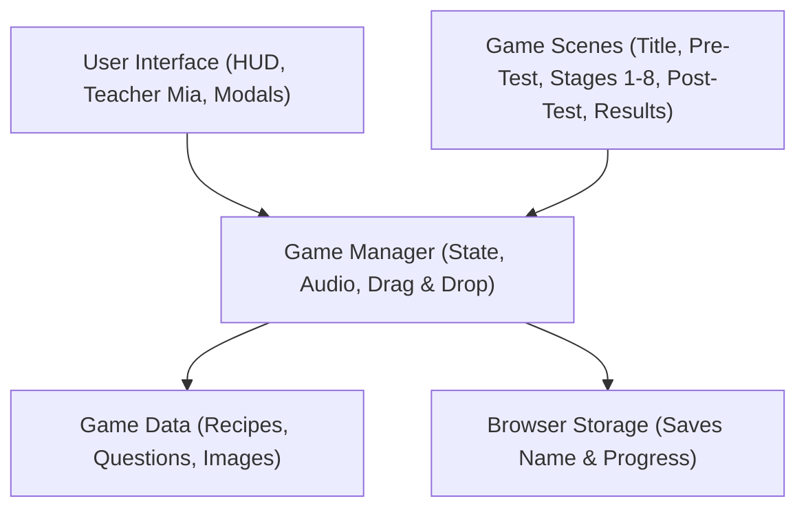
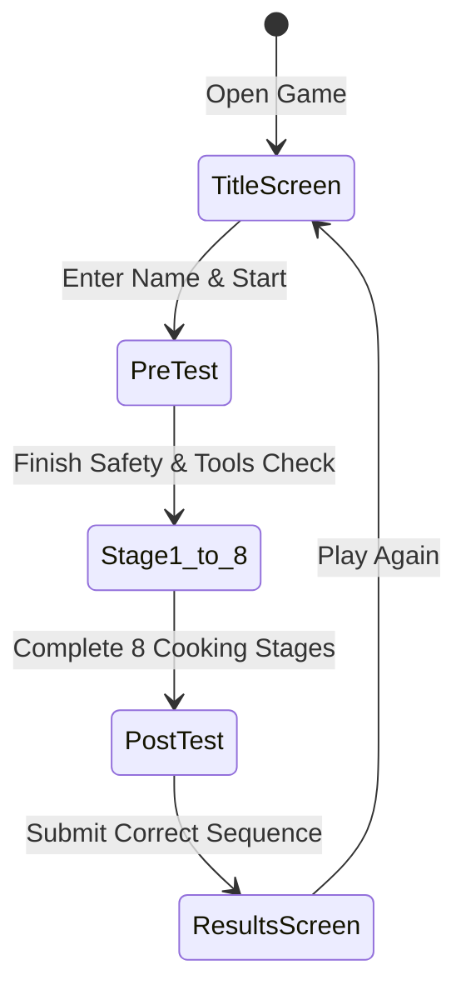
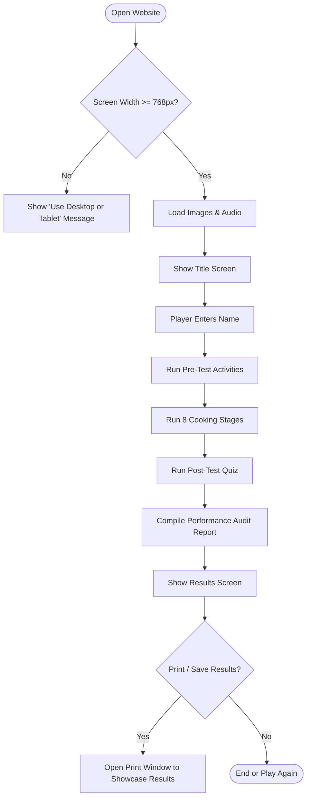
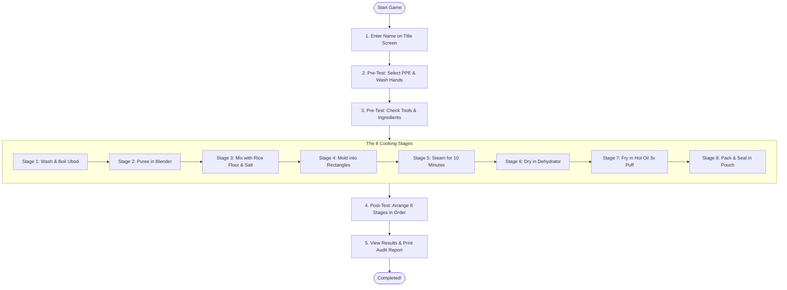

# PITHQUEST: System Architecture, UML Maps & Flowcharts
## Academic Manuscript & Documentation Reference (Corrected)

---

## 1. UML Map 1: System Component Architecture

### Description
This diagram shows the component architecture of the PithQuest web application. It illustrates how the different layers of the software interact to deliver the virtual laboratory experience. The presentation layer consists of the user interface elements that the player sees on screen, including the Header HUD, Teacher Mia's mentor sidebar, and reference modals for objectives and recipes. These components connect directly to the central Game Manager, which controls the global state, audio playback, and drag-and-drop mechanics. The Game Manager coordinates with the scene controllers—handling the transitions between the title, pre-test orientation, the eight cooking workstations, the post-test exam, and the final results screen. In addition, the system accesses local browser storage to save player credentials and references a static database containing standardized recipes, assessment questions, and graphic assets.

---

## 2. UML Map 2: Game State Navigation

### Description
This state diagram illustrates the overall state navigation and operational flow of the PithQuest educational game. It begins at the Title Screen, where students input their name and can review learning guidelines before entering the laboratory. Once started, the game transitions into the Pre-Test orientation state, which requires the player to complete four mandatory baseline activities: selecting appropriate personal protective equipment (PPE), arranging the 7-step handwashing procedure, inspecting tool safety, and verifying ingredient quality. After clearing the pre-test, the system unlocks the main gameplay loop, directing the player sequentially through the eight hands-on cooking stages. Upon completing the final packaging stage, the game transitions into the Post-Test sequencing state to test process retention. Finally, the player reaches the Results state, which compiles an itemized performance audit report showcasing the student's procedural compliance, answers, and observations, with an option to print the results report or reset the game for a new batch.

---

## 3. System Flowchart: Technical Application Flow

### Description
This flowchart illustrates the technical execution and system flow of the PithQuest web application. It begins when the user accesses the web application URL, where the system immediately performs a screen width verification. If the display width is below 768 pixels, the application displays a screen restriction overlay prompting the user to rotate their device to landscape mode or switch to a desktop or laptop display. Once a compatible screen size is detected, the application enters the loading phase to preload graphical assets and initializes the procedural Web Audio engine upon the player's initial click. The system then mounts the title interface, retrieves any existing student records from local storage, and manages user input across all laboratory scenes. As the player completes each activity, the engine records the student's choices, answers, and procedural steps. At the end of the session, the system compiles the performance audit report showcasing the user's laboratory results and triggers the browser's native print API when the user chooses to print or showcase the report as a PDF.

---

## 4. Gameplay System Flowchart: User Navigation & Mechanics

### Description
This flowchart shows the gameplay navigation and instructional process of PithQuest. It begins with the Title Screen where students register their name and can access reference modals such as the learning objectives, science concepts, and standard recipe. Clicking the start button leads the player into the Pre-Test phase, where they must correctly equip sanitary PPE, sequence the WHO 7-step handwashing method, and inspect kitchen tools and fresh ingredients. The flowchart highlights the main gameplay loop, which guides the student through the eight authentic processing stages of coconut pith crackers: washing and boiling, pureeing, 1:1 starch formulation, rectangular molding, steaming, cabinet dehydration, flash deep frying, and sanitary packaging. Each stage begins with a conceptual pre-check question from Teacher Mia before unlocking the interactive workstation. After completing all eight stages, the player is directed to the Post-Test phase to reconstruct the complete manufacturing sequence. Successfully submitting the sequence directs the player to the Results screen, which showcases a comprehensive audit report detailing the student's procedural decisions, food science explanations, and an option to print the results to showcase their performance.
