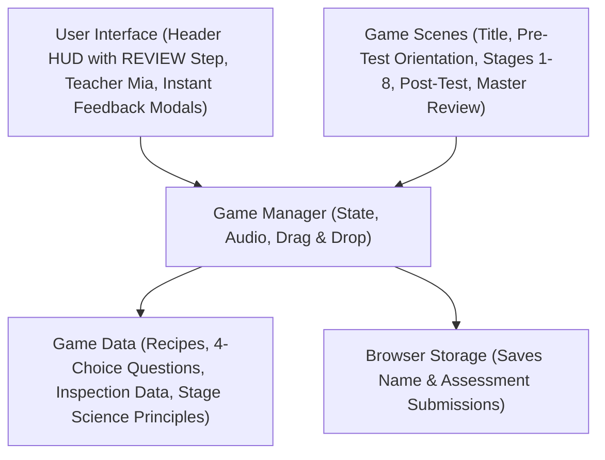
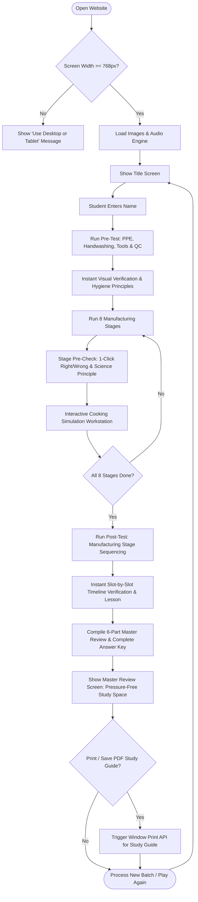
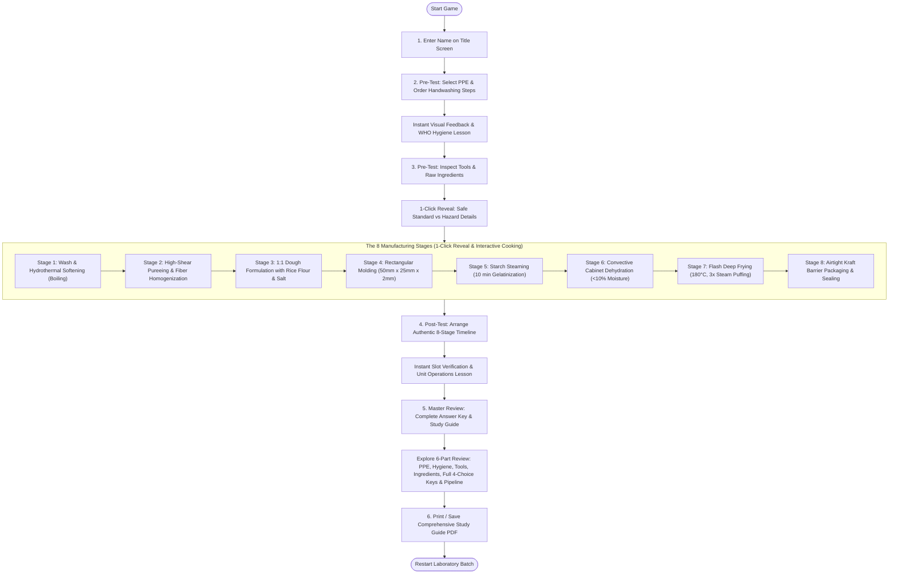

# PITHQUEST: System Architecture, UML Maps & Flowcharts
## Academic Manuscript & Documentation Reference (Updated Flow & Instructional Model)

---

## 1. UML Map 1: System Component Architecture

### Description
This diagram illustrates the revised component architecture of the PithQuest web application, emphasizing its role as an active instructional material. The presentation layer comprises the primary user interface elements, including the top Header HUD (featuring the **`REVIEW`** final stage step), Teacher Mia's interactive pedagogical dialogues, recipe reference modals, and instant formative feedback checkpoint modals. These UI elements connect directly to the central Game Manager (`GameContext`), which governs application state, procedural Web Audio effects (`soundManager`), and interactive drag-and-drop mechanics. 

The Game Manager coordinates scene routing across the five major architectural phases: the Title Screen, Pre-Test Orientation, eight interactive Manufacturing Workstations, the Post-Test Process Sequencing assessment, and the comprehensive **Master Review & Complete Answer Key**. The system persists student credentials and assessment choices to browser storage (`localStorage`) while drawing upon structured static data stores containing standardized recipe formulations, 4-choice checkpoint questions with distractors, equipment inspection criteria, and food science biochemical principles.

---

## 2. UML Map 2: Game State Navigation

```mermaid
stateDiagram-v2
    [*] --> TitleScreen: Open Application
    TitleScreen --> PreTest: Enter Name & Begin
    
    state PreTest {
        [*] --> PPE_Selection: Don Sanitary Barriers
        PPE_Selection --> PPE_Feedback: Instant Barrier Verification
        PPE_Feedback --> Handwashing: Proceed to Hygiene
        Handwashing --> Handwash_Feedback: Instant Slot-by-Slot Validation
        Handwash_Feedback --> Tool_Inspection: Proceed to Equipment QC
        Tool_Inspection --> Tool_Feedback: 1-Click Safe/Hazard Reveal
        Tool_Feedback --> Ingredient_QC: Inspect Raw Materials
        Ingredient_QC --> Ingredient_Feedback: 1-Click Freshness Reveal
        Ingredient_Feedback --> [*]: Pre-Test Verified
    }
    
    PreTest --> Stage1_to_8: Unlock Manufacturing Workstations
    
    state Stage1_to_8 {
        [*] --> PreCheckQuestion: Open Stage
        PreCheckQuestion --> InstantScienceReveal: 1-Click Right/Wrong & Principle
        InstantScienceReveal --> InteractiveWorkstation: Proceed to Hands-On Cooking
        InteractiveWorkstation --> StageComplete: Finish SOP Steps
        StageComplete --> [*]: Advance to Next Stage (1 to 8)
    }
    
    Stage1_to_8 --> PostTest: Complete Packaging (Stage 8)
    
    state PostTest {
        [*] --> ArrangeTimeline: Reconstruct 8-Stage Flow
        ArrangeTimeline --> VerifySequence: Submit Sequence
        VerifySequence --> InstantSequenceFeedback: Real-Time Slot Validation & Unit Ops Lesson
        InstantSequenceFeedback --> [*]: Sequence Debriefed
    }
    
    PostTest --> MasterReview: Proceed to Master Review
    
    state MasterReview {
        [*] --> QuickJumpNavigation: 6-Part Directory
        QuickJumpNavigation --> StudyMasterAnswerKey: 4-Choice Review & Science Principles
        StudyMasterAnswerKey --> PrintStudyGuide: Print / Save PDF
        StudyMasterAnswerKey --> RestartBatch: Process New Batch
    }
    
    MasterReview --> TitleScreen: Restart Batch
```

### Description
This state diagram illustrates the operational state transitions of PithQuest under its formative instructional model. Rather than withholding feedback until the end of the session, the application provides **immediate right/wrong verification at every milestone**:
1. **Pre-Test State**: Divided into four sequential safety activities (PPE attire selection, WHO 7-step handwashing, tool safety inspection, and raw ingredient quality control). Each activity provides instant visual confirmation (highlighting compliant items in green, hazards in red, and missed standards in amber) alongside teacher audio feedback and food hygiene principle callouts before unlocking the next task.
2. **Manufacturing Stages State (Stages 1–8)**: Each stage begins with an instructional Checkpoint Question Modal employing a **1-click instant reveal (Option B)**. Selecting any option immediately illuminates whether it was correct or incorrect, indicates the recommended standard procedure, plays auditory feedback, displays the underlying biochemical rationale, and unlocks the interactive cooking simulation.
3. **Post-Test Sequencing State**: The student arranges the eight production stages chronologically. Submitting the timeline executes real-time slot verification with target position indicators and presents the unit operations progression lesson.
4. **Master Review State**: Replaces traditional scorecards and certificates with a pressure-free **Instructional Debrief & Complete Master Answer Key**, featuring a 6-part navigation directory, full 4-choice question breakdowns, and an option to print a comprehensive study guide PDF or restart a new laboratory batch.

---

## 3. System Flowchart: Technical Application Flow

### Description
This flowchart traces the technical execution and system lifecycle of the PithQuest platform. Upon initial page access, the system evaluates client display dimensions; viewports narrower than 768 pixels trigger an orientation/device advisory overlay. Once verified, the application preloads graphic assets and initializes the Web Audio API context upon the user's first interactive gesture. 

As the student advances, the application enforces formative learning cycles:
- Pre-test choices are evaluated instantaneously against HACCP and GMP baselines.
- Mission stage checkpoints employ synchronous single-click state dispatching to reveal rationales immediately before unlocking cooking workstations.
- Post-test stage submissions evaluate chronological permutations in real time.
- Upon completion, the system transitions to the **Master Review** state (`scene === 'results'`), which bypasses grading counters and instead aggregates student selections against official answer keys, rendering detailed food chemistry explanations and offering PDF study guide export via the browser's native print API.

---

## 4. Gameplay System Flowchart: User Navigation & Mechanics

### Description
This flowchart outlines the student user journey through PithQuest's eight authentic unit operations for coconut pith (*ubod*) cracker manufacturing. The curriculum begins with registration on the Title Screen, followed by Pre-Test sanitary orientation where learners receive real-time verification while donning personal protective equipment, executing the WHO 7-step handwashing friction sequence, and screening food-contact tools and raw materials. 

The core processing sequence takes students through eight authentic unit operations:
1. **Hydrothermal Softening**: Thermal breakdown of cellulosic plant tissue and PPO enzyme denaturation.
2. **Mechanical Pureeing**: High-shear fiber homogenization into a uniform microscopic matrix.
3. **Paste Formulation**: 1:1 formulation of boiled ubod puree and pure rice flour for balanced amylose/amylopectin elasticity.
4. **Precision Molding**: Standardized 50mm × 25mm × 2mm geometry for uniform thermal conductivity.
5. **Atmospheric Steaming**: 10-minute 100°C starch gelatinization locking the viscoelastic dough matrix.
6. **Cabinet Dehydration**: Convective drying at 90°C reducing moisture content below the critical 10% threshold.
7. **Flash Deep Frying**: Rapid immersion at 180°C triggering instantaneous steam expansion and 3× structural puffing.
8. **Airtight Barrier Packaging**: Nitrogen-flushed aluminum-laminated Kraft pouch sealing preventing lipid oxidation.

Each stage begins with an instant-reveal conceptual checkpoint question before interactive cooking simulation begins. Following Stage 8, the Post-Test puzzle reinforces chronological retention with instant slot verification. Finally, the student enters the **Master Review**, an interactive study guide and answer key that breaks down all test questions, choices, standards, and scientific principles with complete print-to-PDF support.
